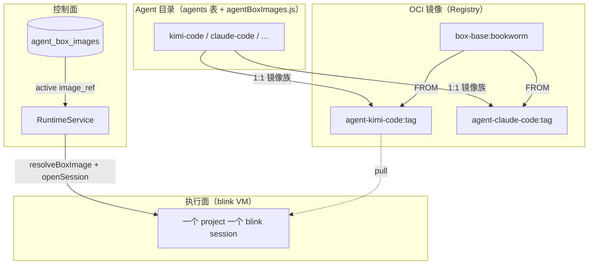

# Agent 镜像设计（Agent Images）

> 状态：已实现（2026-07-07）  
> 适用范围：`RUNTIME_PROVIDER=boxlite` 下的 per-agent OCI rootfs 镜像、构建流水线、Admin 版本注册  
> 上位规范：[`Architecture.md`](./Architecture.md) §5.4.2 BoxLite Managed Sandbox Runtime  
> 相关：[`Sandbox-Integration.md`](./Sandbox-Integration.md)、[`DurableSessions-Followups.md`](./DurableSessions-Followups.md) §3

---

## 1. 背景与目标

Blink 默认沙箱 rootfs 为 **Alpine/musl**，无 Node.js。XEnsemble 内置 agent 多为 **glibc ELF** 或 **npm CLI**，无法在 stock 镜像中直接运行。

本设计解决三件事：

1. **镜像制作** — Debian bookworm + Node 22 + 各 agent CLI 预装进 OCI 镜像  
2. **Agent ↔ 镜像绑定** — 每个 agent 对应独立镜像族；启动 session 时按 agent 选镜像  
3. **版本注册** — 控制面只存镜像**元数据**（tag、digest、active）；blob 在 OCI Registry，由 blink 拉取  

**不在启动时现场安装 agent CLI**。Session start 只做：开沙箱 → 注入凭证/配置 → `spawn` 已预装的命令。

---

## 2. 核心概念：Agent、镜像、Runtime



| 概念 | 说明 |
|------|------|
| **Agent** | 平台 catalog 中的一条记录（`agents` 表）：`id`、`cmd`、`args`、认证方式等 |
| **Agent 镜像** | 含该 agent CLI 的 OCI rootfs，命名 `{registry}/agent-{tag}:{version}` |
| **Base 镜像** | `xensemble/box-base:bookworm` — Debian + Node + git/curl/gh/vim 等常用工具，无 agent CLI |
| **Project Runtime** | 每个 project 一条 `runtimes` 记录；boxlite 下对应一个 blink session（name = `runtimeId`） |
| **镜像版本** | `agent_box_images` 表中的一行；同一 agent 可有多版本，**至多一个 `is_active`** |

**绑定关系**

- **Agent → 镜像族**：catalog 中 `kimi-code` → 默认 `xensemble/agent-kimi-code:*`  
- **Agent → 当前生效镜像**：解析链（见 §6）得到具体 `image_ref`  
- **Project → 沙箱实例**：同一 project 同一时刻一个 VM；**换 agent 且镜像不同**时会删除并重建 blink session  

**Local runtime 不参与镜像体系**：`RUNTIME_PROVIDER=local` 时 agent CLI 装在**控制面宿主机** PATH 上（Admin → Install），`ensureProjectRuntime` 不解析、不持久化 `specs.image`。

---

## 3. Agent 与镜像 Catalog

唯一源码：`server/src/runtime/agentBoxImages.js` 中的 `AGENT_BOX_IMAGE_CATALOG`。

### 3.1 可构建 agent

满足以下条件的 agent 会进入 `listBuildableAgentImages()`，被 `build-images.sh` 批量构建：

- `buildable !== false`  
- 存在 install 命令（catalog 覆盖或 `agentLifecycle.js` 的 `install` / `preInstall && install`）

当前可构建（14 个）：`kimi-code`、`claude-code`、`droid`、`commandcode`、`openclaw`、`opencode`、`cline`、`codebuddy`、`glm-agent`、`qoder`、`qwen-code`、`minimax-cli`、`pi`、`github-copilot`。

默认镜像名：`{XENSEMBLE_AGENT_IMAGE_REGISTRY}/agent-{catalog.tag}:{XENSEMBLE_AGENT_IMAGE_TAG}`  
例：`xensemble/agent-kimi-code:latest`。

### 3.2 不可构建 agent

| agent | 原因 |
|-------|------|
| `cursor` | install 脚本依赖宿主机环境 |
| `amp` | install 脚本为 host-specific |
| `hermes` | install 会改写 home 目录布局 |

boxlite 下启动这些 agent 会 **400**，除非设置 `BLINK_IMAGE_<AGENT_ID>` 指向自定义镜像。不会静默回退到 base 镜像（base 里没有 CLI）。

### 3.3 Install 命令来源（构建时）

优先级：

1. `AGENT_BOX_IMAGE_CATALOG[agentId].install`（如 `droid` 的 curl 脚本）  
2. 否则 `agentLifecycle.js`：`preInstall && install` 或 `install`  

构建在 **无 API key** 环境下执行；用户凭证在 **session spawn** 时注入（env 或沙箱内 config 文件）。

### 3.4 新增 agent 镜像 checklist

1. 在 `defaultAgents.js` 增加 agent 定义  
2. 在 `agentLifecycle.js` 增加 `install`（或 catalog 覆盖）  
3. 在 `AGENT_BOX_IMAGE_CATALOG` 标记 `buildable: true`（及可选 `tag` / `install`）  
4. 本地 `npm run build:agent-images` 验证 Docker build  
5. push registry → Admin 注册并激活版本  

---

## 4. 镜像制作（Build Pipeline）

### 4.1 目录结构

```
boxlite/
  build-images.sh           # 构建 base + 全部 buildable agent
  images/
    base/Dockerfile         # debian:bookworm-slim + Node 22 + git/curl/gh/vim 等常用工具
    agent/Dockerfile        # ARG AGENT_INSTALL — 在 base 上 RUN install
```

### 4.2 Base 镜像

- **默认 tag**：`xensemble/box-base:bookworm`  
- **内容**：Debian bookworm-slim、Node **22**（glibc，满足 kimi-code ≥22.19）、git、curl、ca-certificates、openssh-client（git over SSH）、less、vim-tiny、make、unzip、file、gh（GitHub CLI，官方 apt 源）  
- **不含**：API key、用户凭证、tini entrypoint（由 blink 管理生命周期）

### 4.3 Per-agent 镜像

Dockerfile 在 build 时执行：

```dockerfile
ARG AGENT_INSTALL="npm install -g @moonshot-ai/kimi-code"  # 示例
RUN bash -lc "${AGENT_INSTALL}"
```

CLI 安装到镜像内 `/usr/local/bin` 或 `$HOME/.local/bin`（已在 PATH）。

### 4.4 构建命令

仓库根目录：

```bash
# 构建全部 catalog 中的 agent（需要 Docker）
npm run build:agent-images
# 别名
npm run build:boxlite-images

# 常用环境变量
export XENSEMBLE_AGENT_IMAGE_REGISTRY=ghcr.io/yourorg
export XENSEMBLE_AGENT_IMAGE_TAG=2026.07.07
export XENSEMBLE_BOX_BASE_IMAGE=${XENSEMBLE_AGENT_IMAGE_REGISTRY}/box-base:bookworm
export PUSH_IMAGES=1    # 构建后 docker push

npm run build:agent-images
```

构建列表由 `listBuildableAgentImages()` 动态生成，与 server catalog **保持同步**。

### 4.5 构建与运行的网络

- **构建期**：Docker build 需能访问 npm registry、各 agent 安装 URL（如 factory.ai）  
- **运行期**：沙箱出网由 `boxliteNetwork.js` / `BLINK_NETWORK` / `BLINK_ALLOW_NET` 控制（见 [`deploy/blink.env.example`](../deploy/blink.env.example)）

---

## 5. Registry 与 blink 拉取

镜像 blob 存放在 OCI Registry；blink-server 在 `openSession` 时按 `image` 字段拉取 rootfs。

控制面 env（命名/默认）：

| 变量 | 用途 |
|------|------|
| `XENSEMBLE_AGENT_IMAGE_REGISTRY` | 镜像名前缀（默认 `xensemble`） |
| `XENSEMBLE_AGENT_IMAGE_TAG` | 默认 tag（默认 `latest`） |
| `BLINK_BASE_IMAGE` / `BLINK_IMAGE` | base 镜像 fallback |
| `BLINK_IMAGE_<AGENT_ID>` |  per-agent 覆盖（如 `BLINK_IMAGE_KIMI_CODE`） |
| `BLINK_API_URL` | blink-server（默认 `http://127.0.0.1:8787`） |

blink 侧 registry 配置示例（HTTP 本地 registry）：

```bash
# /etc/xensemble/blink.env
BLINK_IMAGE_REGISTRIES=localhost:5000@http
```

安装 blink：`deploy/install-blink-server.sh`。详见 [`deploy/blink.env.example`](../deploy/blink.env.example)。

---

## 6. Session 启动：镜像解析与 Agent 执行

### 6.1 调用链

```
POST /api/v1/session/start { agent_id, project_id }
  → ensureProjectRuntime(project, { agentId })
      → resolveBoxImage({ agentId })
      → BoxLiteRuntimeProvider.ensureReady({ image, agentId, … })
          → blink POST /api/sessions（挂载 workspace volume）
  → resolveSpawnEnv（gateway / BYOK 凭证）
  → ensureKimiConfig 等 agent 特有 bootstrap（BYOK 写 ~/.kimi/config.toml）
  → BoxLiteExecAdapter.spawn(cmd, args, env)   # 如 spawn("kimi", [], env)
```

**不在此路径执行 `npm install` 或 `installAgent()`**。Admin 的 Install Agent 仅用于 **Local runtime 宿主机**。

### 6.2 镜像解析优先级（`resolveBoxImage`）

| 优先级 | 来源 |
|--------|------|
| 1 | 内部 `opts.image` |
| 2 | 环境变量 `BLINK_IMAGE_<AGENT_ID>` |
| 3 | DB **`agent_box_images` 中 `is_active=true` 且 `status=ready`** |
| 4 | 默认名 `{registry}/agent-{tag}:{tag_suffix}` |
| 5 | Base 镜像 `BLINK_BASE_IMAGE` / `BLINK_IMAGE` / `xensemble/box-base:bookworm` |

当解析结果与 `runtimes.specs.image` 不一致时，`BoxLiteRuntimeProvider` **删除并重建** blink session，使新 rootfs 生效。

### 6.3 示例：Kimi Code

| 阶段 | 行为 |
|------|------|
| **镜像构建** | `npm install -g @moonshot-ai/kimi-code` 写入 `agent-kimi-code` 镜像 |
| **开沙箱** | `openSession(image=…/agent-kimi-code:…)`，挂载 project workspace |
| **Gateway 模式** | `agentEnv.js` 注入 `KIMI_MODEL_*` env，随 spawn 传入 |
| **BYOK 模式** | `ensureKimiConfig` 在沙箱内写 `~/.kimi/config.toml`（Kimi 只读此文件） |
| **Spawn** | `spawn("kimi", [], env)`，PTY 交互 |

Kimi 在 catalog 中 `env_required: []`；认证不走通用 API key env，而靠 config.toml 或 gateway 专用 env。

---

## 7. Admin 版本注册与发布

### 7.1 UI

Web Admin → **Images**（`/admin/images`，旧路径 `/admin/boxlite-images` 重定向）

能力：

- 查看 base 镜像与构建命令提示  
- 每个 agent 的 **active** 镜像与历史版本  
- **Register**：CI push 后登记 tag、`image_ref`、可选 digest/notes  
- **Activate** / **Deprecate**  

**Admin 不触发 Docker build**（控制面不假设有 Docker socket）。

### 7.2 API（需 admin 鉴权）

两套路径等价：

- `/api/v1/admin/agent-images`  
- `/api/v1/admin/boxlite/agent-images`（向后兼容）

| Method | Path | 说明 |
|--------|------|------|
| `GET` | `…/agent-images` | catalog + 各 agent 版本列表 |
| `POST` | `…/agent-images/:agentId/versions` | 注册版本 |
| `POST` | `…/agent-images/versions/:versionId/activate` | 设为 active |
| `POST` | `…/agent-images/versions/:versionId/deprecate` | 废弃 |

### 7.3 典型发布流程

1. CI 或运维机：`PUSH_IMAGES=1 npm run build:agent-images`  
2. Admin → Images → 对应 agent → Register（填 tag、`image_ref`、digest）  
3. 勾选 **Set as active** 或稍后 Activate  
4. 用户启动该 agent 的 session → runtime 使用 active 镜像  

---

## 8. 数据模型

表 `agent_box_images`（PostgreSQL）：

| 字段 | 说明 |
|------|------|
| `id` | 主键 `img_*` |
| `agent_id` | FK → `agents.id` |
| `image_ref` | 完整 OCI 引用，如 `ghcr.io/org/agent-kimi-code:2026.07.07` |
| `tag` | 逻辑版本号（与 agent 联合唯一） |
| `digest` | 可选 `sha256:…`（审计用；runtime 尚未按 digest pin） |
| `status` | `ready` / `deprecated` |
| `is_active` | 是否为该 agent 当前默认镜像 |
| `built_at` / `notes` / `created_by` | 元数据 |

---

## 9. 代码索引

| 区域 | 路径 |
|------|------|
| Catalog 与命名 | `server/src/runtime/agentBoxImages.js` |
| DB 注册/激活 | `server/src/runtime/AgentBoxImageService.js` |
| 运行时选镜像 | `server/src/runtime/RuntimeService.js` → `BoxLiteRuntimeProvider.js` |
| Session 启动 | `server/src/server.js`、`server/src/session/resumeSession.js` |
| Kimi BYOK bootstrap | `server/src/workspace/kimiConfigBootstrap.js` |
| 构建脚本 | `boxlite/build-images.sh`、`boxlite/images/*/Dockerfile` |
| Admin 路由 | `server/src/routes/admin.js` |
| Admin UI | `web/src/pages/ImagesAdmin.jsx` |
| Schema | `server/src/db/schema.js` → `agentBoxImages` |

---

## 10. 验证

**单元测试：**

```bash
cd server
node --test src/runtime/agentBoxImages.test.js \
             src/runtime/AgentBoxImageService.test.js \
             src/runtime/BoxLiteRuntimeProvider.test.js
```

**端到端（需 Linux + KVM + blink-server + 已 push 的镜像）：**

1. 构建并 push 至少一个 agent 镜像（如 `kimi-code`）  
2. Admin 注册并 activate  
3. `RUNTIME_PROVIDER=boxlite`，启动该 agent session  
4. 沙箱内 exec 确认 CLI 存在（如 `which kimi`）  
5. L2 agent 可额外验证 idle 休眠唤醒（P4）  

---

## 11. 限制与后续

| 项 | 状态 |
|----|------|
| Admin 内触发 build | 未实现；仅 CLI/CI |
| Runtime 按 digest pin | 未实现；仅存储 digest |
| 每 project 同时一个镜像 | 换 agent 会重建 session |
| 不可构建 agent | 需 `BLINK_IMAGE_*` 或改用 Local |
| 真实 agent boxlite e2e | 依赖镜像 pipeline 闭环；见 `DurableSessions-Followups.md` §3 |
| CI workflow 自动 build/push | 未接入 `.github/workflows` |

---

## 12. 相关文档

- 执行面集成总览：[`Sandbox-Integration.md`](./Sandbox-Integration.md)  
- Agent catalog 与认证：[`agents.md`](./agents.md)  
- 可恢复会话与镜像依赖：[`DurableSessions.md`](./DurableSessions.md)、[`DurableSessions-Followups.md`](./DurableSessions-Followups.md)
