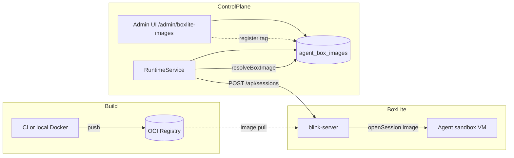

# BoxLite Agent Images

> Status: implemented (2026-07-05)  
> Scope: `RUNTIME_PROVIDER=boxlite` — per-agent OCI rootfs images, build pipeline, Admin version registry  
> Related: [`BoxLite-Blink-Integration.md`](./BoxLite-Blink-Integration.md), [`DurableSessions-Followups.md`](./DurableSessions-Followups.md) §2–§3

---

## 1. Problem

Blink’s default sandbox rootfs is **Alpine/musl** with no Node.js. Most XEnsemble agents are **glibc ELF** or **npm CLIs** and cannot run in that stock image. Durable session wake/resume also requires agent state directories on the **box filesystem**, not the control-plane host (see follow-up §2 — runtime FS contract).

This feature adds:

1. **Build pipeline** — glibc base + Node 20 + per-agent CLI baked into OCI images  
2. **Runtime selection** — boxlite sessions open with the image for the requested agent  
3. **Admin registry** — register, activate, and deprecate image versions in the Web Admin UI  

Image **blobs** live in a Docker/OCI registry. XEnsemble stores **metadata only** (`agent_box_images` table).

---

## 2. Architecture



**Image resolution order** (highest wins):

| Priority | Source |
|----------|--------|
| 1 | Explicit `opts.image` (internal) |
| 2 | Env `BLINK_IMAGE_<AGENT_ID>` (e.g. `BLINK_IMAGE_DROID`) |
| 3 | DB **active** version for that agent |
| 4 | Default name `{registry}/agent-{id}:{tag}` |
| 5 | Base image `BLINK_BASE_IMAGE` / `BLINK_IMAGE` / `xensemble/box-base:bookworm` |

When the resolved image differs from `runtimes.specs.image`, `BoxLiteRuntimeProvider` **deletes and re-opens** the blink session so the new rootfs is used.

---

## 3. Build pipeline

### Directory layout

```
boxlite/
  build-images.sh          # builds base + all buildable agents
  images/
    base/Dockerfile        # debian:bookworm-slim + Node 20 + git/curl
    agent/Dockerfile         # ARG AGENT_INSTALL — runs agent install script
```

### Build commands

From repo root:

```bash
# Build all catalogued agents (requires Docker)
npm run build:boxlite-images

# Optional env
export XENSEMBLE_AGENT_IMAGE_REGISTRY=ghcr.io/yourorg
export XENSEMBLE_AGENT_IMAGE_TAG=2026.07.05
export PUSH_IMAGES=1          # docker push after each build
npm run build:boxlite-images
```

The script reads **`server/src/runtime/agentBoxImages.js`** (`listBuildableAgentImages()`) so the build list stays in sync with the server catalog.

### Base image

- **Default tag:** `xensemble/box-base:bookworm`  
- **Contents:** Debian bookworm-slim, Node 20 (glibc), git, curl, ca-certificates, tini  
- **Not included:** API keys or user credentials (injected at spawn via existing agent env resolution)

### Per-agent images

- **Default tag pattern:** `{registry}/agent-{agent-id}:{tag}`  
- **Install:** npm global install or documented curl script from `agentLifecycle` / `AGENT_BOX_IMAGE_CATALOG`  
- **Skipped agents:** `cursor`, `amp`, `hermes` (host-specific or non-reproducible install scripts)

---

## 4. Environment variables

| Variable | Purpose |
|----------|---------|
| `XENSEMBLE_AGENT_IMAGE_REGISTRY` | Registry prefix (default `xensemble`) |
| `XENSEMBLE_AGENT_IMAGE_TAG` | Default tag suffix when resolving unnamed versions (default `latest`) |
| `BLINK_BASE_IMAGE` | Base image for git/fs-only runtime ops |
| `BLINK_IMAGE` | Fallback base if `BLINK_BASE_IMAGE` unset |
| `BLINK_IMAGE_<AGENT_ID>` | Per-agent override (`BLINK_IMAGE_DROID`, `BLINK_IMAGE_CLAUDE_CODE`, …) |
| `BLINK_API_URL` | blink-server URL (default `http://127.0.0.1:8787`) |
| `RUNTIME_PROVIDER` | Set to `boxlite` to enable BoxLite provider |

---

## 5. Admin UI & API

**UI:** Web Admin → sidebar **BoxLite Images** (`/admin/boxlite-images`)

Operators can:

- View base image and build command hint  
- See each agent’s **active** image and full **version history**  
- **Register** a version after CI push (tag, `image_ref`, optional digest/notes)  
- **Activate** a version (becomes runtime default for that agent)  
- **Deprecate** old versions  

**API** (admin auth required):

| Method | Path | Action |
|--------|------|--------|
| `GET` | `/api/v1/admin/boxlite/agent-images` | Catalog + versions |
| `POST` | `/api/v1/admin/boxlite/agent-images/:agentId/versions` | Register version |
| `POST` | `/api/v1/admin/boxlite/agent-images/versions/:versionId/activate` | Set active |
| `POST` | `/api/v1/admin/boxlite/agent-images/versions/:versionId/deprecate` | Deprecate |

### Typical release flow

1. CI runs `npm run build:boxlite-images` with `PUSH_IMAGES=1` → images in registry  
2. Admin registers tag `2026.07.05` with digest from CI  
3. Check **Set as active version** (or activate later)  
4. Start/resume agent sessions under `RUNTIME_PROVIDER=boxlite` — runtime uses the active image  

---

## 6. Code map

| Area | Path |
|------|------|
| Image catalog & naming | `server/src/runtime/agentBoxImages.js` |
| DB service (register/activate) | `server/src/runtime/AgentBoxImageService.js` |
| Runtime image swap | `server/src/runtime/BoxLiteRuntimeProvider.js` |
| Session start/resume + agentId | `server/src/server.js`, `server/src/session/resumeSession.js` |
| State dir on runtime FS | `server/src/runtime/{Local,BoxLite}FsAdapter.js`, `server/src/session/stateDir.js` |
| Admin routes | `server/src/routes/admin.js` |
| Admin UI | `web/src/pages/BoxLiteImagesAdmin.jsx` |
| Schema | `server/src/db/schema.js` → `agent_box_images` |

---

## 7. Verification

**Unit tests:**

```bash
cd server
node --test src/runtime/agentBoxImages.test.js \
             src/runtime/AgentBoxImageService.test.js \
             src/runtime/BoxLiteRuntimeProvider.test.js
```

**End-to-end (requires Linux + KVM + blink-server):**

1. Build and push at least one agent image (e.g. `claude-code`)  
2. Register and activate it in Admin  
3. `RUNTIME_PROVIDER=boxlite`, start session for that agent  
4. Confirm agent CLI runs inside the box (`which claude` via box exec)  
5. For L2 agents, verify resume/wake after idle hibernate (P4)  

---

## 8. Limitations & follow-ups

- **Build in Admin UI:** not implemented; builds run via CLI/CI (Docker socket not assumed on control plane)  
- **Digest verification:** stored for audit; runtime does not yet pin by digest at blink open  
- **One image per project runtime:** switching agents on the same project recreates the blink session when the image changes  
- **Non-buildable agents:** still require Local runtime or custom env override  
- See [`DurableSessions-Followups.md`](./DurableSessions-Followups.md) for blink-server restart recovery, OSC terminal echo, and test DB isolation  
