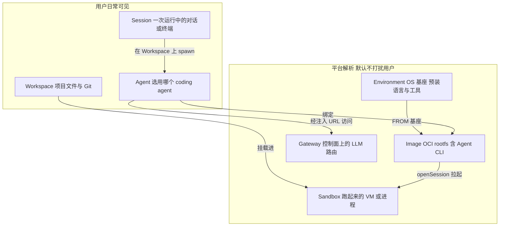

# XEnsemble 核心概念

> 用户 Console 主路径与平台分层术语。上位规范：[`Architecture.md`](./Architecture.md)、[`Agent-Images.md`](./Agent-Images.md)

---

## 分层关系

| 概念 | 是什么 | 不是什么 |
|------|--------|----------|
| **Workspace** | 用户的代码与文件空间（DB 表仍为 `projects`） | 不是 Agent，也不包住 Agent |
| **Environment** | 不含 Agent 的 computer 基座（现约等于 `box-base`） | 不是 Session 配置，也不是 agent env vars |
| **Image** | 可启动的 OCI rootfs：Built-in = Environment + 预装 Agent CLI；Custom = 用户拼装镜像 | 不是「再注册一个 Agent」 |
| **Agent** | 平台 catalog 里的一种 agent（命令、鉴权、镜像族） | 不是一次运行实例 |
| **Sandbox** | Runtime 拉起的隔离执行体（blink VM / local 进程） | 用户无需管理其 id |
| **Session** | 在某个 Workspace 上、用某个 Agent、在某个 Sandbox 里的一次运行 | 不是 Agent 本身 |
| **Gateway** | 控制面侧 LLM 路由（UniGateway），Agent 连出去用 | **不在**沙箱内 |

一句话：**Workspace 提供文件；Environment/Image 提供机器；Agent 是跑在上面的程序；Session 是这次跑起来的实例；Sandbox 是承载实例的容器；Gateway 在控制面给 Agent 供模型。**

---

## Console 主路径

普通用户只需三步：

1. **Workspace** — 创建或导入代码空间（侧栏 Workspaces）
2. **Agent** — 在启动 Session 时选择（不是「新建 Agent」；注册 Agent 在 Admin）
3. **Session** — 侧栏 **New Session** → 选 Workspace + Agent → **Start session**

平台在后台自动：按 Agent 解析 active Image → 拉起 Sandbox → 挂载 Workspace → spawn Agent CLI。

高级选项（默认折叠）：Custom Image。Environment 选择将在产品化后出现在 Advanced 或 Admin。

---

## 界面术语对照

| 区域 | 呈现 |
|------|------|
| 侧栏主 CTA | New Session |
| 启动弹窗 | New Session：Workspace + Agent |
| 主区终端 | Agent 会话（`AgentConsole`） |
| 右侧面板「Workspace shell」 | 工作区 shell，与 Agent 会话分开 |
| Configure | Agent variables（传给 Agent 进程的变量与 secrets） |
| Admin → Agent Images | 各 Agent 的 OCI 镜像注册与激活 |
| Admin → Agent Images → Environment | 只读展示 base image（OS 基座） |
| Admin → Gateway | LLM 路由配置（用户不可见） |
| Pending 状态 | Starting sandbox… |

---

## 与现有实现

- **Image 解析**：[`Agent-Images.md`](./Agent-Images.md) — `box-base` → `agent-*`，Session start 时 `resolveBoxImage`
- **dev_environment_profiles**：项目 scaffold/profile，**不是** OS Environment 实体
- **Local runtime**：不走镜像体系，Agent CLI 装在控制面宿主机 PATH
