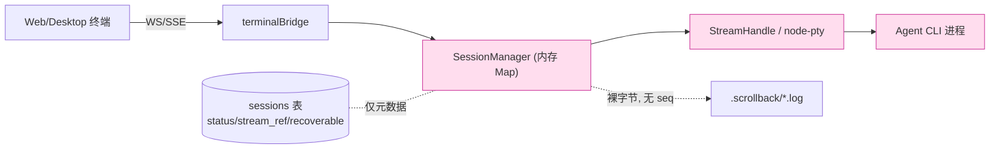
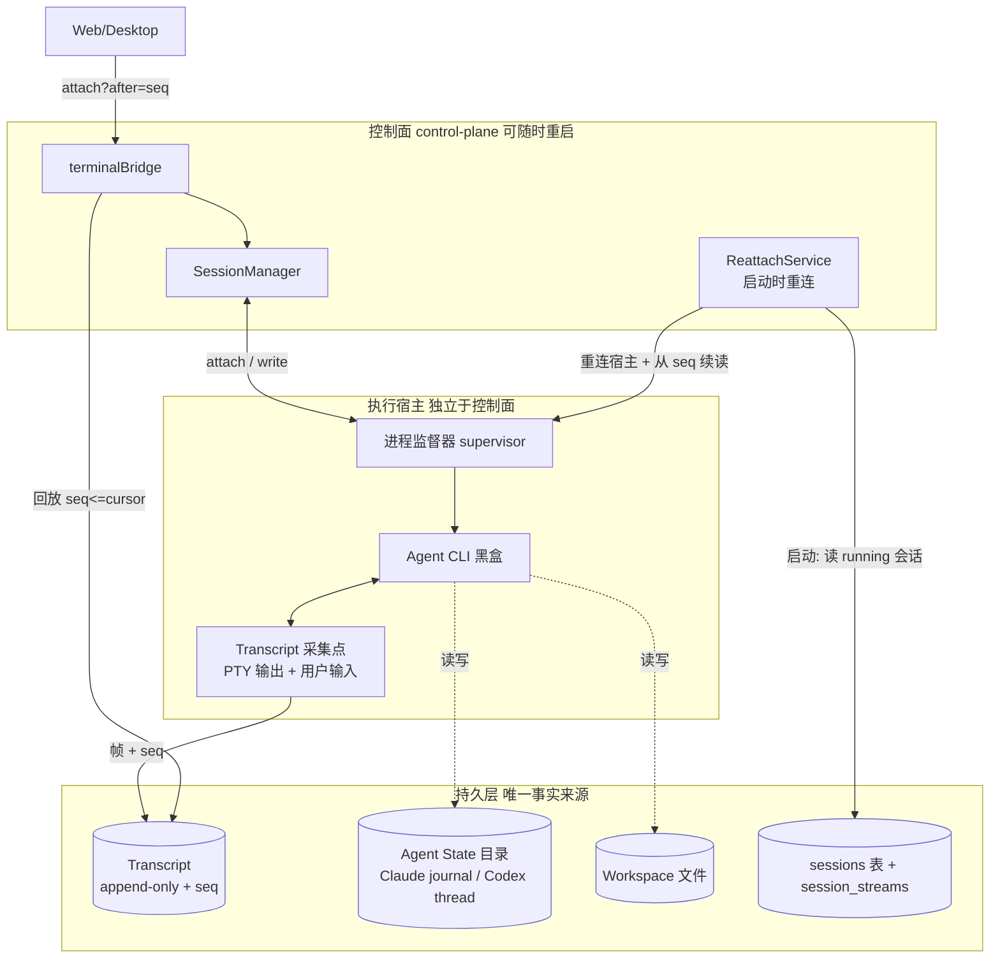
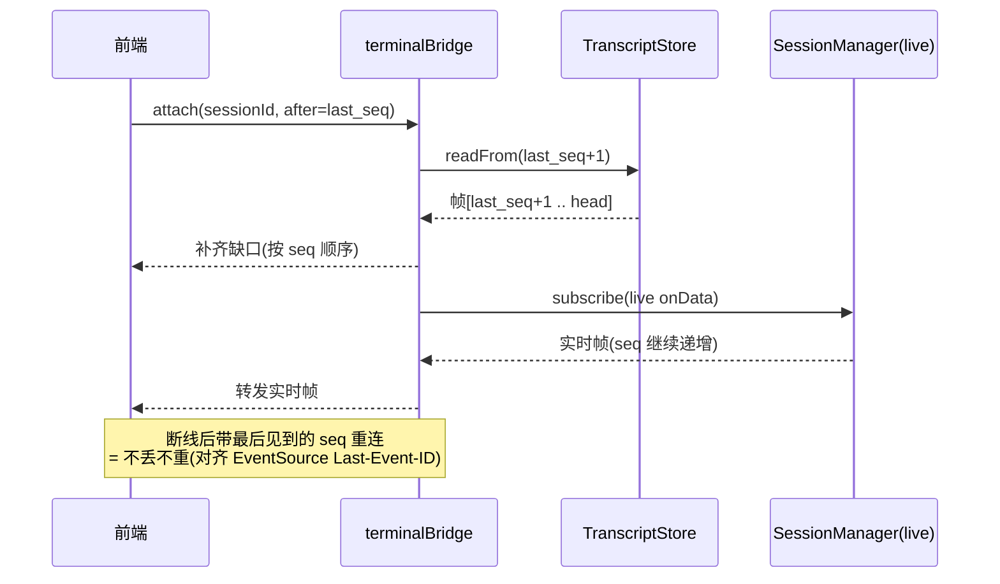
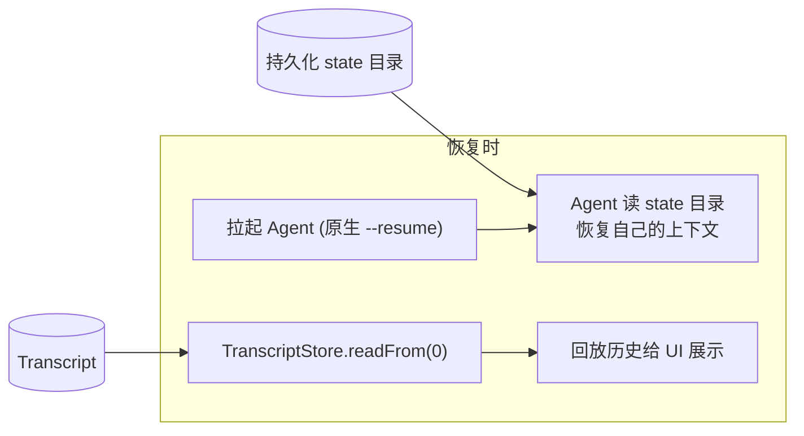
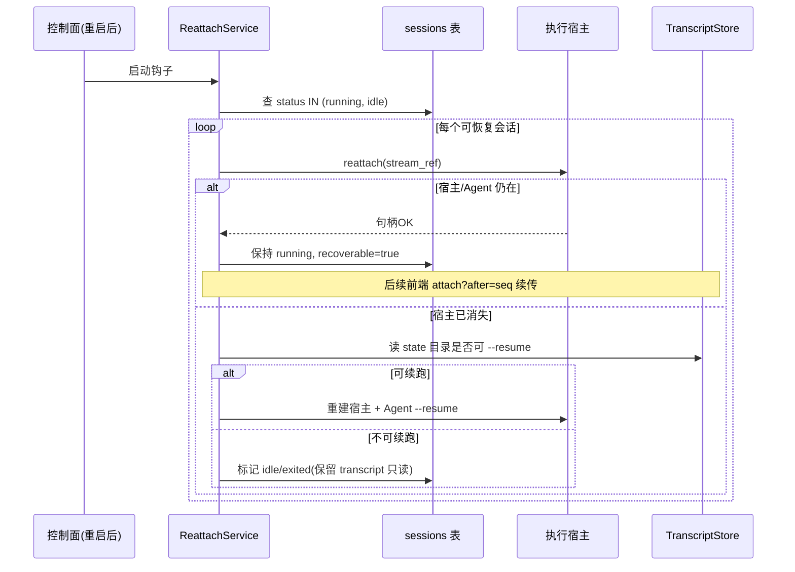
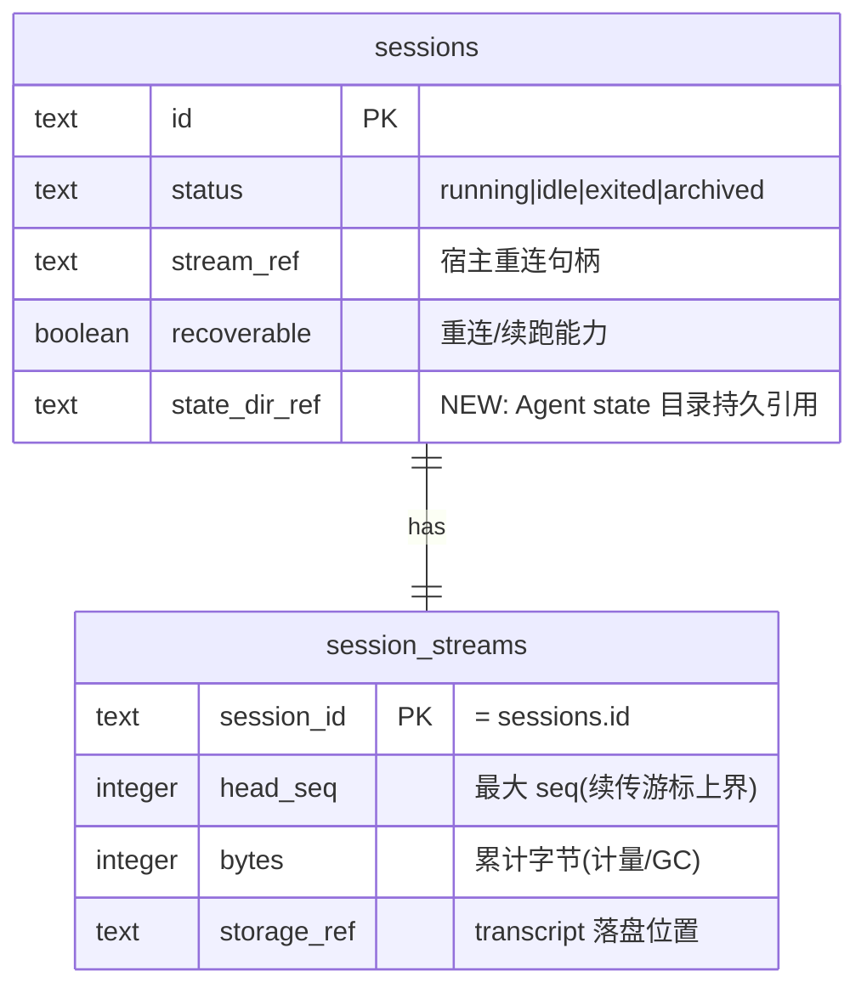
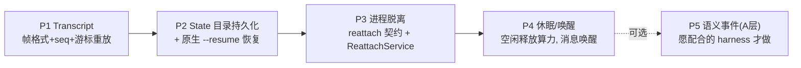

# XEnsemble 可恢复会话设计（Durable Sessions）

> 状态：设计草案（Design Draft）
> 日期：2026-07-04
> 适用范围：`server/` 控制面 Session / Runtime 子系统
> 上位规范：本文件是 [`docs/Architecture.md`](./Architecture.md) 的补充设计，不覆盖其约束；执行面三层 Provider 抽象（Local / BoxLite / K8s）保持不变。

---

## 0. 一句话目标

在**不接管、不改造被引入的原生 Agent CLI**（Claude Code / Codex / 其它流行 harness）的前提下，让 XEnsemble 的会话具备**断线续传、控制面重启不丢会话、空闲休眠/唤醒**的能力。

做法是三根支柱，全部把 Agent 当**黑盒**：

1. **B 层 Transcript**：在终端字节边界记一条 append-only、带 `seq` 游标的流水，作为会话的持久事实来源。
2. **State 目录持久化**：把 Agent 自带的会话状态目录随 workspace 一起持久化，恢复时用 Agent 原生 `--resume` 续跑。
3. **执行进程脱离控制面**：Agent 进程运行在独立于 control-plane 的被监督宿主里，控制面重启后**重新 attach**，而不是把会话判死。

> **明确不做**：不解析 Agent 内部语义（tool call / turn / message）、不接管 Agent loop、不要求 Agent 配合结构化输出。语义级事件日志（OC 式）是**可选的后续增强**，不是本设计的前置门槛（见 §7 的 P5）。

---

## 1. 背景：现状为什么会话不可恢复

当前会话状态**绑在控制面进程的内存里**，磁盘上只有一份"尽力而为"的 scrollback。

| 环节 | 现状 | 文件 |
|------|------|------|
| 活会话句柄 | `SessionManager` 用内存 `Map` 持有 `StreamHandle`(PTY)，`history` 是易失缓存 | `server/src/session/SessionManager.js` |
| 磁盘留存 | `LocalScrollbackBuffer` 把 PTY 输出裸字节 `appendFileSync` 到 `.scrollback/<ref>.log`；**无 seq、无输入、无边界、读取截断尾部 100KB** | `server/src/runtime/LocalScrollbackBuffer.js` |
| 前端订阅 | `subscribeTerminal` 先把 `history` 整段回放，再转发实时 `onData`；**无游标，断线只能整段重放或丢失** | `server/src/session/terminalBridge.js` |
| 重启处理 | `reconcileRunningSessions` 检测 `streamRef` 里的 pid，进程不在就把 `running` 直接改 `exited`；`recoverable` 默认 `false` | `server/src/session/reconcileRunningSessions.js`、`server/src/db/schema.js` |
| 进程归属 | `LocalExecAdapter` 用 `node-pty` **由控制面直接 fork**，控制面死则子进程随之消亡 | `server/src/runtime/LocalExecAdapter.js` |

### 现状数据流（as-is）



- 红/粉块 = 易失：控制面进程一停，`SessionManager`、`StreamHandle`、Agent 子进程一起没。
- `.scrollback` 虽在盘上，但**不是**结构化流水，无法做"从游标 N 之后精确续传"，也不含用户输入，无法完整重建会话。

**根因**：真相在进程里，不在盘上。下面三根支柱就是把真相搬到盘上，并让算力可丢弃可重连。

---

## 2. 目标架构总览



蓝块 = 持久，控制面与执行宿主都可重启，会话不丢。

---

## 3. 支柱一：B 层 Transcript（终端字节流水）

### 3.1 定位

把 Agent 当黑盒，在 **PTY 字节边界** 记录"进出这个终端的一切"：Agent 输出、用户输入、resize、进程退出。这是 asciinema 式思路——不理解内容，但能**从任意游标精确重放**。

### 3.2 记录格式（帧）

每条 transcript 记录是一个帧（frame），单调 `seq` 递增、不可变、只增不改：

```jsonc
{
  "seq": 1287,                 // 会话内单调自增，续传的游标
  "ts": 1751590000123,         // 毫秒时间戳
  "kind": "out",               // out | in | resize | exit | meta
  "data": "<base64 或 utf8>",  // out/in: 终端字节; resize: {cols,rows}; exit: {code}
  "bytes": 412                 // data 原始字节长度（便于计量/截断）
}
```

- `kind:"out"` = Agent → 终端；`kind:"in"` = 用户 → Agent（**现状 scrollback 完全没记这个**，导致无法重建"用户说了什么"）。
- `seq` 是**会话级**单调序号，是断线续传与重启续读的唯一游标。
- 大块输出可离线到对象存储并在帧里放 `content_ref`（对齐现有 `storageRef` 习惯）；MVP 阶段可先全部内联落盘。

### 3.3 落盘形态

沿用现有"文件 + DB 元数据"的分工，避免一上来就重构存储：

- **帧数据**：追加写到 `WORKSPACE_ROOT/.transcript/<sessionId>.ndjson`（每行一帧，NDJSON），替代裸 `.scrollback`。顺序 append，天然 append-only。
- **游标元数据**：DB 新增轻量表 `session_streams`，记录 `session_id`、`head_seq`（最大 seq）、`bytes`、`storage_ref`，便于列表页/计量/GC，不必扫文件。
- `LocalScrollbackBuffer` 演进为 `TranscriptStore`（`append(frame)` / `readFrom(seq)` / `head(sessionId)`），保留同名黑盒语义，Local 实现内部换成帧格式。

### 3.4 断线续传时序



WS/SSE 协议只需在现有 `{type:"output",data}` 上补一个 `seq` 字段，并支持 `attach?after=<seq>`；前端 xterm 侧记住最后 `seq` 即可。

---

## 4. 支柱二：Agent State 目录持久化

### 4.1 关键洞察

**状态持久 ≠ 我们去追踪状态。原生 Agent 自己就存状态。**

- Claude Code 有自己的 session journal / 历史目录，支持 `claude --resume`。
- Codex 有 thread / rollout 状态。
- OC 也承认其 brain 的 provider 状态是靠"checkpoint 一个 state 目录"（Claude journal / Codex thread id）实现的。

所以我们**不重建语义**，只要保住 Agent 自己的状态盘 + 我们的 transcript，恢复就成立。

### 4.2 做法

- 每个 runtime 声明其 Agent 的 **state 目录**（如 `~/.claude/<proj>`、`~/.codex/...`），由 runtime 适配层给出，不写死在控制面。
- state 目录随 **workspace 一起持久化**（workspace 现已持久，见 `server/src/workspace.js`），并纳入现有 checkpoint/snapshot 流程（`repoSnapshots` / workspace checkpoint）。
- **恢复 = 重新拉起 Agent 时带上原生续跑参数**（`--resume` 或等价），指向持久化的 state 目录；transcript 只负责把历史**重放给 UI**，不参与 Agent 语义恢复。



分工清晰：**state 目录管"Agent 记得自己干到哪"，transcript 管"人能看回全过程"。** 两者都在盘上，互不依赖。

---

## 5. 支柱三：执行进程脱离控制面

### 5.1 为什么这是独立的一件事

会话在控制面重启后消失，**根因不是没日志，是 `node-pty` 子进程作为控制面的子进程一起被杀**。所以"进程存活"和"状态持久"要分开解决——即使有了 transcript，如果 Agent 进程还是控制面的孩子，重启照样中断当前那一轮。

### 5.2 做法（按三层 Provider 分别落地）

统一契约：Agent 进程由一个**独立于 control-plane 生命周期的宿主**托管，控制面通过 `streamRef` **重连**它，而不是持有它的父子关系。

| Provider | 脱离方式 | 备注 |
|----------|----------|------|
| **Local（推荐）** | 复用 **blink / BoxLite 本机形态（libkrun）**：Agent 跑在 sandbox 内，生命周期独立于控制面；控制面通过 blink 的 `WS /executions/{id}/attach` 重连 | 已有 `docs/BoxLite-Blink-Integration.md` 与蓝图构建的 blink-server，不必自造轮子 |
| **Local（无 KVM 兜底）** | 一个**常驻 `agent-host` 守护进程**（独立生命周期）持有 PTY，暴露 unix socket；控制面用 detached spawn 拉起后经 socket 重连 | 纯本机开发/无 `/dev/kvm` 环境的降级路径；仅把"父子关系"解开 |
| **BoxLite** | 同 Local 推荐路径，sandbox 由 BoxLite 托管；控制面重连 sandbox 的 exec/PTY 通道 | 与 `docs/BoxLite-Blink-Integration.md` 对齐，最契合本设计 |
| **K8s** | Agent 跑在 Pod 内，控制面重连 Pod 的 attach 流 | 生产层，天然脱离 |

**决策**：不新造"detached 进程 + 专用 agent-host"作为主路径；**主路径统一走 blink/BoxLite（libkrun）**，`agent-host` 守护进程仅作为无 KVM 环境的兜底。这样"进程脱离"与执行面三层 Provider 的既有演进方向合流，不增加第四种执行形态。

> **与现有文档的差异需知会**：`docs/BoxLite-Blink-Integration.md` §恢复模型 目前写的是"跨重启 live PTY 不可恢复，接受 `recoverable=false`（与 Local 一致）"。本设计**主动推翻**这一让步——通过 transcript 续传 + state 目录 `--resume` 把 `recoverable` 提升为 `true`（详见 §4、§9-Q3 的能力分级）。落地 P3 时需同步更新该文档。

`StreamHandle` 接口补充一个 `reattach(streamRef)` 语义：从 `streamRef` 恢复一个可读写的句柄，而非只在 `createSession` 时新建。

### 5.3 控制面重启重连时序



关键差异：现状 `reconcileRunningSessions` 是"**进程不在就判死**"；新流程是"**先尝试重连，重连不上再尝试 --resume，都不行才降级**"，且 transcript 永远保留可回看。

---

## 6. 数据模型改动（增量，不破坏现有表）



- `sessions` 仅新增 `state_dir_ref`（可空），其余复用现有 `status/stream_ref/recoverable`。
- 新表 `session_streams` 存 transcript 元数据；帧本体在文件/对象存储。
- 迁移遵循现有 drizzle 流程，向后兼容：老会话无 transcript 时 fallback 到旧 scrollback 回放。

---

## 7. 分阶段落地（每步独立可交付）



| 阶段 | 交付物 | 收益 | 不伤 drop-in? |
|------|--------|------|---------------|
| **P1** | `TranscriptStore` 替换 `LocalScrollbackBuffer`；WS/SSE 带 `seq` + `attach?after=` | **断线续传**、输入也入账、可完整回放 | ✅ 黑盒 |
| **P2** | runtime 声明 state 目录；随 workspace 持久化；恢复走原生 resume | 会话语义可续跑 | ✅ 黑盒 |
| **P3** | `StreamHandle.reattach`；`ReattachService` 替换"判死"逻辑；进程脱离控制面；**副作用幂等化（硬前置，见 §9-Q4）** | **控制面重启不丢会话**（XEnsemble 现按 transcript 中最后一轮 `rseq` 计算 blink reattach cursor，无单独 cursor 列） | ✅ 黑盒 |
| **P4** | 空闲释放算力 + 消息唤醒（Local 弱、BoxLite/K8s 强） | 成本下降，对齐 OC 休眠模型 | ✅ 黑盒 |
| **P5**（可选） | 对支持结构化输出的 harness（Claude Code `stream-json` / hooks、Codex）提取 `tool.call/message/turn.completed` | level 分层、webhook、精细 steer | ⚠️ 仅增强，不支持则 fallback P1 |

> P1–P4 全程把 Agent 当黑盒，**不牺牲"随便接流行 Agent"这个卖点**。P5 是渐进增强：能拿到多少语义就用多少，拿不到就退回字节流，不是前置门槛。

---

## 8. 与 OpenComputer 的边界对比（为什么我们不照抄）

| 维度 | OpenComputer | XEnsemble 本设计 |
|------|--------------|------------------|
| 日志位置 | **语义层**（在 Agent loop 内插桩，产结构化事件） | **传输层**（PTY 字节 + 用户输入，黑盒） |
| 代价 | 必须自写 adapter 接管每个 harness | 零侵入，任何 terminal Agent 直接跑 |
| 恢复语义 | 平台重放语义事件 + checkpoint state 目录 | Agent 原生 `--resume` + 持久 state 目录 |
| 定位契合 | 卖 webhook/多端/多 runtime | 卖"原生引入流行 Agent 的体验" |
| level 分层 / webhook | 内建 | 归入可选 P5 |

结论：OC 把日志放语义层是因为它要卖 webhook 与统一多端；XEnsemble 的定位决定日志应放**传输层**——从而**同时**拿到"可恢复"与"原生 drop-in"。

---

## 9. 决策（Resolved Decisions）

原"待确认问题"已逐条拍板如下。每条给出**决策 + 理由 + 落地要点**。

### Q1 — Transcript 存储上限与 GC → **两级存储 + 生命周期随会话**

**决策**：transcript 分"热窗口 + 冷归档"两级，GC 挂在会话生命周期上，`seq` 永不复用。

- **热窗口（盘上）**：`WORKSPACE_ROOT/.transcript/<sessionId>.ndjson` 只保留最近 `TRANSCRIPT_HOT_BYTES`（默认 **8MB**，够 UI 回放当前上下文）。超出部分滚动切段。
- **冷归档（对象存储）**：滚出的旧段压缩后写对象存储，帧里/`session_streams.storage_ref` 记引用（复用现有 `storageRef` 习惯）。`readFrom(seq)` 命中冷段时透明回源。
- **单帧过大**（如一次巨量 `exec` 输出）：内联超过 `FRAME_INLINE_MAX`（默认 **256KB**）的 `data` 离线为 `content_ref`，对齐 OC 的 `content_ref` 做法。
- **GC / 保留期**：会话 `archived` 且超过 `TRANSCRIPT_RETENTION_DAYS`（默认 **30 天**）后清冷归档；热文件在会话 `exited/archived` 时即可裁到最小。state 目录跟随 workspace 生命周期回收，不单独 GC。
- **计量**：`session_streams.bytes` 累计，用于配额与 GC 判定，无需扫文件。

> 关键区分：**transcript 是给"人回放"的，不是恢复 Agent 语义的**。所以它可以激进 GC；Agent 能否续跑取决于 state 目录（Q3），二者解耦。

### Q2 — Local 层进程脱离的具体形态 → **主路径走 blink/BoxLite，agent-host 仅兜底**

**决策**：见 §5.2。主路径统一复用 **blink / BoxLite（libkrun）** 的本机 sandbox 形态，控制面经 blink 的 `WS /executions/{id}/attach` 重连；**不新增第四种执行形态**。纯本机无 `/dev/kvm` 时降级到常驻 `agent-host` 守护进程（独立生命周期 + unix socket 重连）。

理由：仓库已有 `docs/BoxLite-Blink-Integration.md` 与蓝图构建的 blink-server，BoxLite sandbox 生命周期天然独立于控制面，正是"进程脱离"所需；让本特性与三层 Provider 演进合流，而非旁生一条。

### Q3 — State 目录的通用性 → **runtime 声明契约 + 能力分级降级**

**决策**：不假设所有 harness 都能 resume；把"状态在哪、怎么续"做成 **runtime 适配契约**，并按能力分级降级。

- runtime 描述符新增两项：`stateDir`（Agent 自带状态目录，如 Claude `~/.claude/…`、Codex thread 目录）与 `resume(sessionRef)`（返回续跑 argv/参数，如 `claude --resume <id>`）。控制面不写死任何 harness 细节。
- DB 存 `sessions.state_dir_ref` + 续跑令牌（session/thread id）。
- **能力分级**（决定 `recoverable` 的真实含义）：
  | 级别 | harness 能力 | 崩溃/重启后 |
  |------|--------------|-------------|
  | **L2 可续跑** | 有稳定 `stateDir` + resume（Claude Code / Codex） | 重连或 `--resume` 续跑，`recoverable=true` |
  | **L1 仅回放** | 无 resume，但输出可记录 | transcript 完整回放给 UI，Agent 不续跑 → 会话降级**只读**，提示用户重开 |
  | **L0 黑盒无状态** | 连稳定输出都无保证 | 等同现状，`recoverable=false` |
- 引入某 harness 时在其 runtime 适配层声明级别；平台按级别决定恢复行为，**不因个别 harness 不支持而阻塞整体设计**。

> **实现备注（P3）**：对 blink/BoxLite 的 reattach cursor，不再使用独立的 throttle/cursor 列；XEnsemble 直接从 durable transcript 的当前执行段扫描 `out` 帧，取最后一个 `exit` 之后的最大 `rseq` 作为 `after=`。如果 transcript 里没有可用 `rseq`，则按非可恢复处理，保持当前行为。

### Q4 — 幂等约束 → **"transcript 即记录，副作用可能重放"写入契约，关键副作用 get-or-create**

**决策**：把"进程脱离 + reattach + 可能 `--resume` ⇒ 最后一轮可能重复执行"作为**显式契约**写进 §5，所有对外副作用必须幂等；P3 前置完成。

- **提 PR**：`PullRequestService` 以 `(sessionId, sourceBranch)` 做 **get-or-create**，重复请求返回同一 PR，绝不开重复 PR（对齐 OC 的 `key` 语义）。
- **Preview**：以 `(sessionId, port)` 幂等创建，命中则复用现有 `publicUrl`。
- **Git push**：同 commit 重推天然幂等，无需额外处理。
- **Transcript 自身**：`seq` 单调 + append-only + **单写者**（同一时刻只有一个 attach 在写），保证重放不会把日志写叉。
- **原则**：把事件日志（transcript）当唯一记录，副作用设计成可重入；无法幂等的副作用不得放在"可能被重放"的turn 边界内。

### Q5 — 前端协议兼容 → **纯增量、向后兼容，复用 EventSource 原生续传**

**决策**：对 `docs/ApiClient.md` 的 WS/SSE 协议**只加不改**，老客户端零改动仍可用。

- **下行帧加 `seq`**：`{type:"output"|"exit", seq, data}` 增加 `seq` 字段；老客户端忽略未知字段，行为不变。
- **续传参数**：WS `GET /ws/v1/terminal?sessionId=…&after=<seq>`；SSE 每条事件带 `id: <seq>`，浏览器 `EventSource` 断线自动用 `Last-Event-ID` 续传，**无需前端手写游标逻辑**。
- **兼容回退**：不带 `after` / 无 `Last-Event-ID` 时，服务端按现状整段 replay（§终端 `subscribeTerminal` 的现有行为），老 Web Console / Desktop 客户端无感。
- **落地面**：改动集中在 `server/src/session/terminalBridge.js`、`server/src/server.js`（WS 路由）、`server/src/routes/terminalHttp.js`（SSE）；`docs/ApiClient.md` §5 同步补 `seq`/`after` 说明。

---

## 10. 决策一览（速查）

| # | 主题 | 决策 |
|---|------|------|
| Q1 | Transcript 存储/GC | 热窗口 8MB 盘上 + 冷段离线对象存储；单帧 >256KB 走 `content_ref`；archived+30d GC；`seq` 不复用 |
| Q2 | Local 进程脱离 | 主路径 blink/BoxLite(libkrun)，agent-host 仅无 KVM 兜底；不加第四种形态 |
| Q3 | State 目录通用性 | runtime 声明 `stateDir`+`resume` 契约；L2 续跑 / L1 只读回放 / L0 现状 三级降级 |
| Q4 | 幂等 | 契约化"副作用可能重放"；PR/Preview get-or-create；transcript 单写者 append-only；P3 前置 |
| Q5 | 前端协议 | 纯增量：下行加 `seq` + `after=`/`Last-Event-ID`；不带则整段 replay，老客户端零改动 |

---

## 11. blink 依赖与需补能力

本节基于对 `EeroEternal/blink`（clone 于 `~/repos/blink`）当前代码的核实，标注每根支柱对 blink 的依赖：**大部分零 blink 改动，唯一硬依赖在 P3（进程脱离/重连）。**

### 11.1 按支柱/阶段的依赖

| 阶段 | 是否依赖 blink | 说明 |
|------|----------------|------|
| **P1 Transcript** | ❌ 不依赖 | 录制在 XEnsemble 控制面：它本就从 `WS /executions/{id}/attach` 收字节，只是自己写带 `seq` 的帧。Local(node-pty) 与 BoxLite 都受益。 |
| **P2 State 目录** | ⚠️ 依赖 blink **已有**能力 | blink session 是持久 BoxLite box（`open_session()` 用 `get_or_create(auto_remove:false, detach:true)`，`src/core/src/context.rs:50-93`），跨 blink-server 重启存活；state 目录随 session 持久。恢复只是再 spawn 一条 `agent --resume`，**无需 blink 加功能**。 |
| **P3 进程脱离 + reattach** | ✅ **硬依赖，需 blink 加能力** | 见 §11.2，是唯一需要改 blink 的地方。 |
| **P4 休眠/唤醒** | ✅ 依赖 blink，部分已有 | checkpoint/restore/export/import 已实现（`context.rs:117-176`、`snapshots().create(...)`），但 `warm` 参数当前是 **no-op**（`open_session()` 忽略它，`context.rs:81-93`），无 idle/hibernate/wake 生命周期，需补。 |
| **Local 无 KVM 兜底** | ❌ 不依赖 | 走自研 `agent-host` 守护进程。 |

### 11.2 P3 需要 blink 补的三件事（核实结论）

blink 当前 execution 是**内存态、一次性 attach**，不支持重连：

1. **execution 变为可重复 attach（当前一次性消费）**
   `attach_exec()` 在升级 WS 前调用 `state.execs.take(&exec_id)`，首次 attach 即把注册表项摘除（`src/server/src/api/exec.rs:89-112`、`exec_registry.rs:20-33`）→ 同一 `execution_id` 无法二次 attach。**需改为**：保留稳定 execution 记录，断开后可再 attach（`take` → 借用/引用计数）。

2. **服务端输出缓冲 + 游标（当前纯直通、无缓冲）**
   attach 是 `start_exec_pump()` → 单个 `mpsc` 接收器的 live passthrough，无回放缓冲、无 seq/offset（`src/core/src/exec.rs:66-154`）→ 无人 attach 时字节直接丢。**需补**：服务端按 execution 缓冲 stdout 并带游标，reattach 时能 `resume from N` 补齐控制面宕机窗口内的字节。（此项决定"人回放"有没有洞；Agent 自身续跑靠 state 目录不受影响。）

3. **execution 记录跨 blink-server 重启可恢复**
   session/box 跨重启存活，但 live execution 是内存态（`ExecRegistry`），blink-server 重启即丢（`exec_registry.rs:9-33`）。**需补**：live execution 的持久登记 + 重启后重建可 attach 句柄。

**已有、可直接用**：execution 在 WS 断开时**不会被杀**（断开只是跳出 WS 循环，pump task 继续持有进程，`api/exec.rs:114-201`）——即"headless 存活"这条已具备，缺的是"再连回去"。

### 11.3 落地建议

- P1/P2 先行，**零 blink 改动即可拿到"断线续传 + 语义续跑"的大头**；P3 的 blink 改动（上述 3 条 reattach 语义）与 XEnsemble 侧 `reattach(stream_ref)` 配套推进。
- blink 帧协议现状：stdout `0x01` / stderr `0x02`，控制帧 JSON（`resize` / `signal` / `stdin_eof`）（`src/core/src/exec.rs:66-185`、`docs/PTY.md`）；加游标可在 attach 握手或 stdout 帧上附带 seq，保持向后兼容。
- blink 为自有仓库（`EeroEternal/blink`，有 PR 权限），上述能力可自行排期实现。
- **P3 blink 侧实现进行中**：可重复 attach + 服务端输出缓冲 + seq 游标（`?after=`/`?seq=1`）已在 blink PR [EeroEternal/blink#9](https://github.com/EeroEternal/blink/pull/9) 落地（设计见该仓库 `docs/REATTACH.md`）；"跨 blink-server 重启可恢复"仍为 follow-up（需 boxlite 支持重开运行中 execution 的 stdio）。
